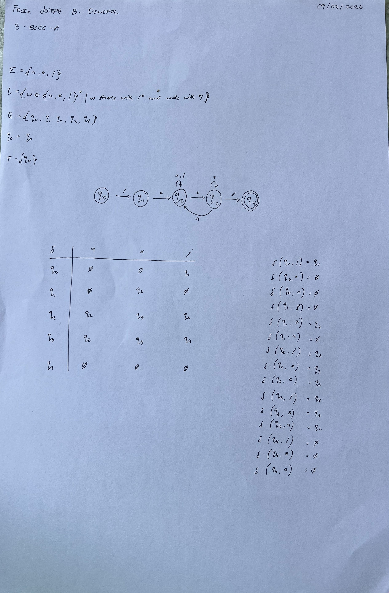
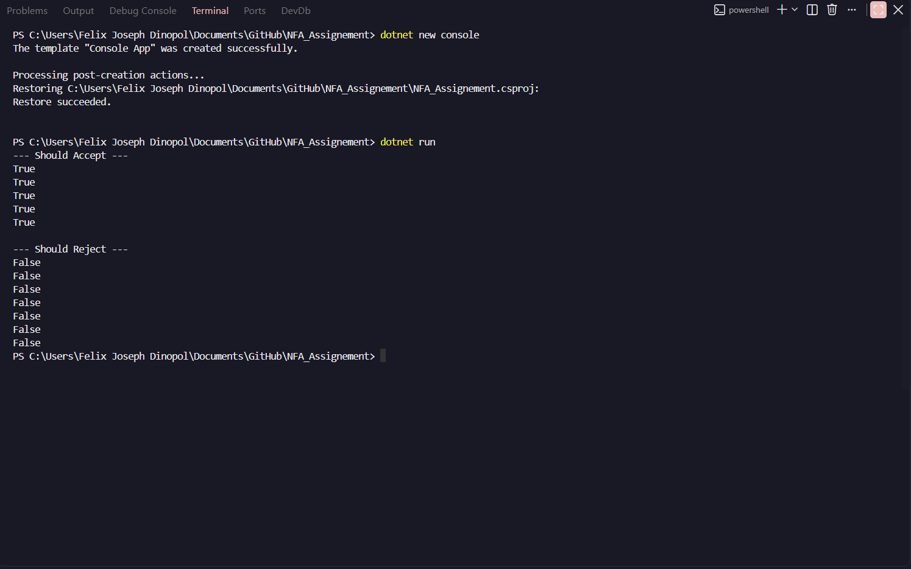

# NFA for C-Style Comments

This repository contains a C# implementation and the theoretical design for a 5-state Non-Deterministic Finite Automaton (NFA) that recognizes valid C-style block comments.

## Assignment Overview

The objective of this assignment is to design an NFA that accepts correct comment syntax in C# (starting with `/*` and ending with `*/`) and rejects comments with incorrect syntax.

The alphabet `Σ` consists of `/`, `*`, and `a` (where `a` represents any character that is not a star or a slash).

The automaton enforces strict rules:

- It must close on the *first* `*/` it encounters.
- It must reject strings that have trailing characters after the comment is closed.
- It must reject unclosed comments or comments with invalid starting sequences.

## Written Activity / State Machine Design

Below is the diagram, mathematical definition, and transition table for the 5-state NFA design.

## C# Implementation

The logic is implemented in C# using a `HashSet<int>` to track the active states of the NFA simultaneously. This properly simulates non-determinism by evaluating all possible paths for a given input, ensuring edge cases are handled without needing a bulky DFA structure.

### Code Output Screenshot

Below is the output of the provided test cases (both accepted and rejected strings) running through the NFA script:

